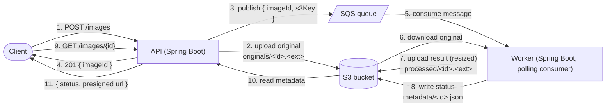

# Image Pipeline

A small asynchronous image processing pipeline built to learn AWS (S3, SQS, ECS Fargate) hands-on as a Java developer, plus Terraform for infrastructure-as-code.

Client uploads an image → API stores it in S3 and publishes a message to SQS → a separate Worker picks up the message, resizes the image, and stores the result back in S3 → client polls a status endpoint and gets a presigned URL to download the result.

This is a portfolio/learning project — deliberately scoped small. See [Out of scope](#out-of-scope) below.

## Architecture



API and Worker are two independent Spring Boot applications (no shared module, no shared deploy) — they only agree on the shape of the SQS message and the S3 key layout.

Full request-by-request walkthrough, with a sequence diagram: [docs/user-journey.md](docs/user-journey.md).

## Stack

| Concern              | Choice                                             |
|-----------------------|-----------------------------------------------------|
| Language / Framework  | Java 21, Spring Boot 4.1                            |
| AWS SDK               | AWS SDK for Java v2 (S3, SQS)                       |
| Image processing      | Thumbnailator                                       |
| Containers             | Docker-compatible multi-stage builds (JDK → JRE)   |
| Local AWS emulation   | LocalStack                                          |
| Infrastructure        | Terraform (S3 backend with native locking)          |
| Deploy target          | AWS ECS Fargate                                     |

## Project layout

```
api/                  Spring Boot app — upload + status endpoints
worker/                Spring Boot app — SQS consumer + image processing
infra/terraform/       All AWS infrastructure as code
docs/                  User journey / sequence diagram
scripts/               dev-api.sh / dev-worker.sh — run each app locally
```

`api` and `worker` are independent Maven projects (own `pom.xml`, own Maven wrapper) — not a multi-module build. `ImageMessage`/`ImageStatus` are intentionally duplicated in both rather than shared, to avoid coupling their deploys together.

## Running locally (LocalStack)

Requires Java 21, a Docker-compatible container runtime (Docker or Podman), and the AWS CLI (with some credentials configured — LocalStack accepts any value, but the CLI itself still needs a profile to exist).

1. Start LocalStack:
   ```bash
   podman run -d --name localstack -p 4566:4566 -e LOCALSTACK_AUTH_TOKEN=<your-token> docker.io/localstack/localstack
   ```
   A free LocalStack account (app.localstack.cloud) is enough to get a token.

2. Create the bucket and queue it expects (see `application.yml` in `api`/`worker` for the exact names, or override them):
   ```bash
   aws --endpoint-url=http://127.0.0.1:4566 s3 mb s3://<bucket-name>
   aws --endpoint-url=http://127.0.0.1:4566 sqs create-queue --queue-name <queue-name>
   ```

3. Run each app (default Spring profile talks to LocalStack on `127.0.0.1:4566`):
   ```bash
   ./scripts/dev-api.sh
   ./scripts/dev-worker.sh
   ```

4. Upload and check status:
   ```bash
   curl -F "file=@some-image.jpg" http://localhost:8080/images
   curl http://localhost:8080/images/<imageId>
   ```

## Running against real AWS

Both apps read AWS config from the `aws` Spring profile (`application-aws.yml`), which blanks out the LocalStack-specific endpoint/credentials overrides so the AWS SDK resolves everything (endpoint, credentials) on its own — using your real AWS credentials (or the ECS task role, when deployed) and the real S3/SQS endpoints.

Activate it with three environment variables — deliberately **not** committed anywhere, since the SQS queue URL embeds the AWS account ID:

```bash
export SPRING_PROFILES_ACTIVE=aws
export APP_S3_BUCKET_NAME=<bucket-name>
export APP_SQS_QUEUE_URL=<queue-url>
```

## Infrastructure (Terraform)

Everything — S3 bucket, SQS queue, IAM roles/policies, VPC networking, ECR repositories, ECS cluster/task definitions/services — is defined in `infra/terraform/`, with remote state in a dedicated S3 bucket (native S3 locking, no DynamoDB needed).

```bash
cd infra/terraform
terraform init
terraform plan
terraform apply
```

The least-privilege IAM policy attached to the ECS task role grants exactly `s3:PutObject`/`GetObject` on the app's bucket and `sqs:SendMessage`/`ReceiveMessage`/`DeleteMessage` on the app's queue — nothing broader.

⚠️ On a first apply against empty infrastructure, don't run a plain `terraform apply` here — the ECS services need images already in ECR to start, and ECR needs to exist before you can push to it. See [Deploying to ECS](#deploying-to-ecs) below for the order that actually works.

## Deploying to ECS

1. On a first-time deploy, the ECR repositories don't exist yet — create just those two, without touching anything else:
   ```bash
   terraform apply -target=aws_ecr_repository.api -target=aws_ecr_repository.worker
   ```

2. Build and push both images to those ECR repositories:
   ```bash
   aws ecr get-login-password --region <region> | podman login --username AWS --password-stdin <account-id>.dkr.ecr.<region>.amazonaws.com

   podman build -t <account-id>.dkr.ecr.<region>.amazonaws.com/image-pipeline-api:latest ./api
   podman push <account-id>.dkr.ecr.<region>.amazonaws.com/image-pipeline-api:latest

   podman build -t <account-id>.dkr.ecr.<region>.amazonaws.com/image-pipeline-worker:latest ./worker
   podman push <account-id>.dkr.ecr.<region>.amazonaws.com/image-pipeline-worker:latest
   ```

3. Apply the rest of the infrastructure (`terraform apply`) so the ECS services can start with images already in place.

4. After pushing a new image to an existing service, force a fresh deployment (ECS won't automatically notice a new `:latest`):
   ```bash
   aws ecs update-service --cluster image-pipeline-cluster --service image-pipeline-api --force-new-deployment
   aws ecs update-service --cluster image-pipeline-cluster --service image-pipeline-worker --force-new-deployment
   ```

Rebuilding this whole environment from nothing (new machine, empty AWS account, no Terraform state)? See [docs/bootstrap.md](docs/bootstrap.md) for the full from-scratch runbook.

## Cost management

Unlike S3/SQS (pay-per-use, effectively free at this scale), **Fargate bills per running task, whether or not anything is actually using it** — there's no free tier. Scale both services down to zero between test sessions instead of leaving them running:

```bash
aws ecs update-service --cluster image-pipeline-cluster --service image-pipeline-api --desired-count 0
aws ecs update-service --cluster image-pipeline-cluster --service image-pipeline-worker --desired-count 0
```

and back up to `1` when you actually want to hit the API again. This doesn't touch the cluster, task definitions, or any other resource — just stops billing for idle compute. `desired_count` in `ecs.tf` is intentionally excluded from drift detection (`lifecycle.ignore_changes`) so toggling it this way doesn't get silently reverted by the next `terraform apply`.

## Possible next steps

Natural next steps if this project keeps growing, not currently planned:

- **Dead-letter queue (SQS)** — messages that fail repeatedly today just get redelivered forever instead of being set aside.
- **Load balancer + HTTPS** — the API is reachable directly on its task's public IP, over plain HTTP; an ALB + certificate would fix that and remove the dependency on an IP that changes on every deploy.
- **Auto scaling** — `desired_count` is fixed today (toggled manually for cost control); scaling the Worker based on SQS queue depth would be the next level.
- **Alarms/monitoring** — only CloudWatch logs exist today, no alarms (e.g. a task going down, the queue backing up).

## Out of scope

Kept deliberately out, to stay focused on the AWS/Terraform learning goal:

- User authentication
- Multiple processing filters (only resize/thumbnail)
- Frontend/UI
- CI/CD pipeline
