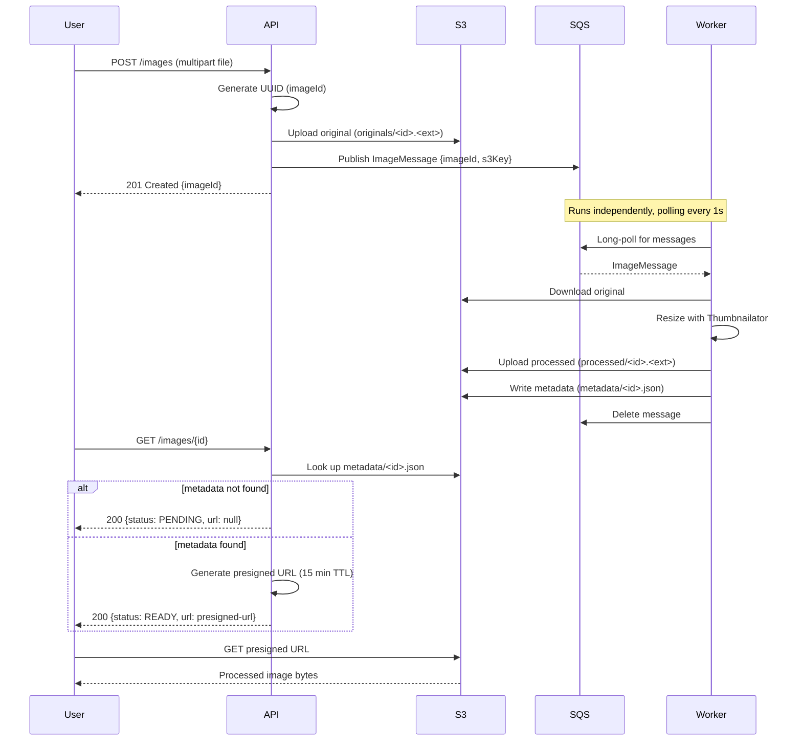

# User Journey: Image Upload and Processing Pipeline

This document describes the end-to-end flow of the image pipeline, from the moment a user uploads an image to the moment they retrieve the processed result.

## Flow diagram

## Step-by-step

### 1. Upload request

The client sends `POST /images` with the image as a multipart file. Handled by `ImageController.upload(...)`.

### 2. Identity and key generation

The API generates a new `UUID` (`imageId`) and computes the S3 key for the original file: `originals/<imageId>.<extension>`.

### 3. Original stored in S3

The API uploads the file to the bucket under `originals/`. At this point the upload is durable, but processing hasn't happened yet.

### 4. Work item published to SQS

The API builds an `ImageMessage { imageId, s3Key }`, serializes it to JSON, and publishes it to the SQS queue — signaling that a new image is waiting to be processed.

### 5. Immediate response to the client

The API responds right away with `201 Created` and the `imageId`, without waiting for processing to complete. This is what makes the pipeline asynchronous: upload and processing are decoupled in time.

### 6. Worker polls the queue

Independently of the request/response cycle above, `ImageProcessor.poll()` runs on a schedule (every second, using SQS long polling) and picks up the message whenever it arrives.

### 7. Original downloaded

Using the `s3Key` from the message, the Worker downloads the original file from S3.

### 8. Image processed

The Worker resizes the image with Thumbnailator (200x200, aspect ratio preserved), producing a thumbnail in memory.

### 9. Processed result stored in S3

The thumbnail is uploaded to the same bucket under `processed/`, at the equivalent key (`originals/` swapped for `processed/`).

### 10. Status metadata written

The Worker writes `metadata/<imageId>.json` containing `{ "status": "READY", "processedKey": "processed/<imageId>.<ext>" }`. This file is what the status endpoint later reads to determine whether processing is done.

### 11. Message deleted

Only after steps 7–10 all succeed does the Worker delete the SQS message. If any step fails, the message is never deleted, and SQS makes it visible again for a future retry.

### 12. Status request

The client sends `GET /images/{id}` at any point after the upload, handled by the same `ImageController`.

### 13. Metadata lookup

The API attempts to fetch `metadata/<id>.json` from S3:
- **Not found** → the Worker hasn't finished (or hasn't started) yet. Response: `{ "status": "PENDING", "url": null }`.
- **Found** → the API reads the `ImageStatus` content.

### 14. Presigned URL generation

If the status is ready, the API uses `S3Presigner` to generate a temporary, self-contained URL pointing at the `processedKey`, valid for 15 minutes. This is required because the bucket is private — a plain S3 path would return "Access Denied" to any client without AWS credentials.

### 15. Final response

The API returns `{ "status": "READY", "url": "<presigned-url>" }`.

### 16. Client fetches the result

The client opens the presigned URL directly (e.g., in a browser) and retrieves the processed image bytes — no AWS credentials required, and the bucket itself remains fully private.
